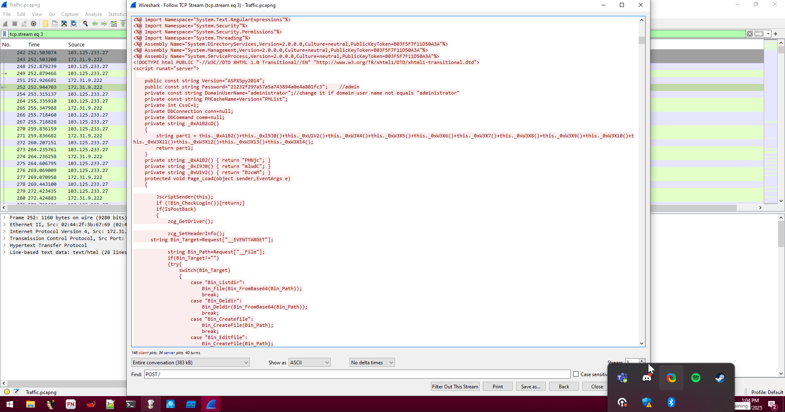
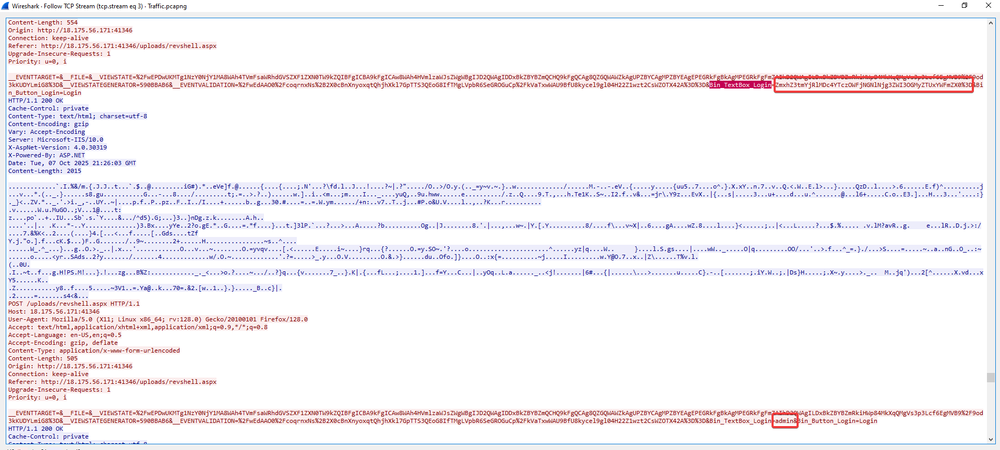

# Webshellz
**CTF:** Huntress CTF 2025
**Category:** Forensics  
**Points:** 10  
**Challenge Description:**

```md
The sysadmin reported that some unexpected files were being uploaded to the file system of their IIS servers.

As a security analyst, you have been tasked with reviewing the Sysmon, HTTP, and network traffic logs to help us identify the flags!
```

```md
The password to the ZIP archive is webshellz
```

## Initial Discoveries

First I checked the HTTP.log since it is a small and easily checkable file. From this file all we can really learn is the attack path. The attacker started by enumerating files like View.aspx, robots.txt, /.env, and /uploads. We can see that the user makes a POST request (presumably a file upload) and then runs GET on it many times.

Next, since I am more experienced in it, I searched through the eventlog file. From the saved log we can see that the commands: `net user IIS_USER VJGSuERc6qYAYPdRc556JTHqxqWwLbPwzABc0XgIhgwYEWdQji1 /add`, `ipconfig /all`, `net user`.

Obviously the one that creates a new IIS_USER will be the most helpful. It seems that the password is an encoded string of sorts. Decoding by Base62, we get: `flag{03638631595684f0c8c461c24b0879e6}`.

This seems like the only info we can get from the EventLogs, and so its time to move onto the final file, the packet capture.

----------

Through following the TCP Stream in the packet capture, we can see many of the requests that we seen in HTTP.log.

We really want to know what was in the revshell.aspx file. By looking for the POST packet, we find all of the code in a packet. 



First I seen the variable called part1, but this turned out to be a rabbit hole and took me to a site that the revshell uses. Lets look else where since their doesn't seem to be something helpful within the file itself.

Looking at the surrounding packets, we see a server_port setting having a comment `MZWGCZ33MM3WEYJXGZRTAYJUGQ4DIZTFHBRTCMZVMEYTCOJVMU4GIOJUMVSH2===` this seems very sus and after throwing it into cyberchef with base32 decode it returns: `flag{c7ba76c0a4484fe8c135a1195e8d94ed}`

----------



Finally, onto the last question. Since the question mentions logins and the webshell has a login, I looked at the login packet and found that there was actually 2, one that worked (admin) and one that didn't (`ZmxhZ3tmYjRlMDc4YTczOWFjNGNlNjg3ZWI3OGMyZTUxYWFmZX0=`). Hey thats Base64 encoded string! Flag: `flag{fb4e078a739ac4ce687eb78c2e51aafe}` 

## Answers

Something funky is going on with a new account that was created. Can you find the flag? This flag ends with a `6`. 3 points

> `flag{03638631595684f0c8c461c24b0879e6}`

There seems to be some Funky Random Program! This flag ends with a `d`. 3 points

> `flag{c7ba76c0a4484fe8c135a1195e8d94ed}`

How did the threat actor attempt to gain access to the webshell? This flag ends with a `e`. 4 points

> `flag{fb4e078a739ac4ce687eb78c2e51aafe}`
