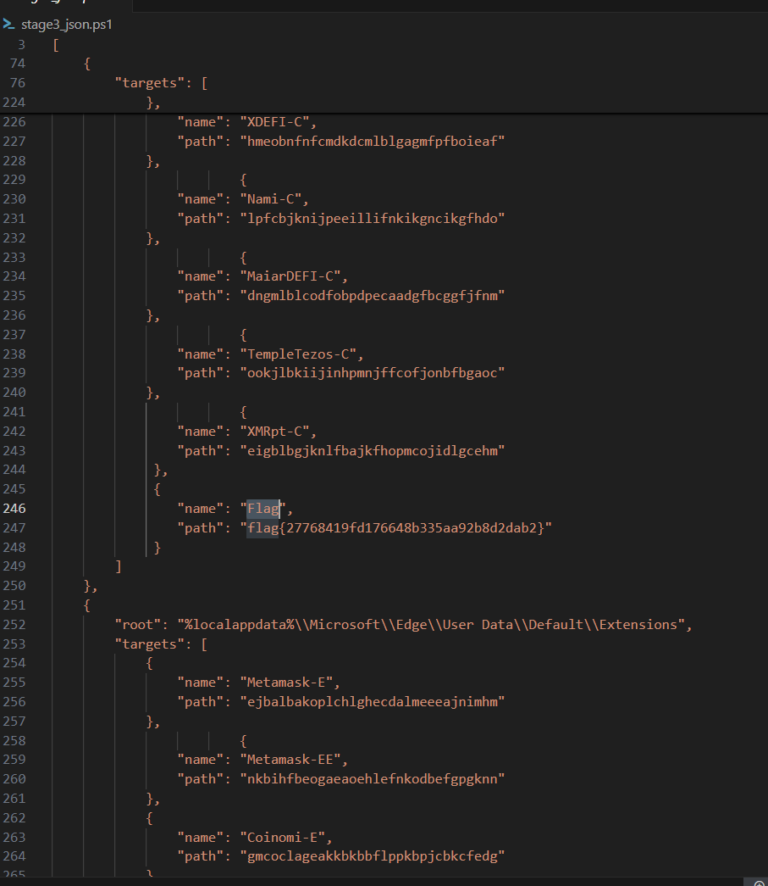

# SANDY
**CTF:** Huntress CTF 2025
**Category:** Malware  
**Points:** 10  
**Challenge Description:**

```md
My friend Sandy is really into cryptocurrencies! She's been trying to get me into it too, so she showed me a lot of Chrome extensions I could add to manage my wallets. Once I got everything sent up, she gave me this cool program!

She says it adds better protection so my wallets can't get messed with by hackers.

Sandy wouldn't lie to me, would she...? Sandy is the best!
```
## Initial Observations
Immediately after unzipping the file and running a tool like DetectItEasy, it can be found that the exe is actually a compiled AutoIt script. Running the autoit-ripper script, we can extract the original script. In this script is a lot of obfuscation, but the main part is the large base64_chunks variable. Base64 decoding these chunks will give u our stage2.ps1 file. Which is full of many more base64 encoded powershell scripts. The first seven are really just nonsense and I couldn't find any use for them.

However the last couple are important. Starting with the last one, we find the start script, which establishes persistence through a scheduled task triggering every 11 minutes. Nothing CTF related though. Moving onto the variable right above, we can find the main method. Here we can see how the C2 is handled and the server used, however once again there is nothing to use for the CTF.

## Flag

One of the variables in stage2.ps1 was called encodedJson, and after unencoding it, I thought it was mostly just extensions and their path. Inside this flag was actually the flag.



`flag{27768419fd176648b335aa92b8d2dab2}`