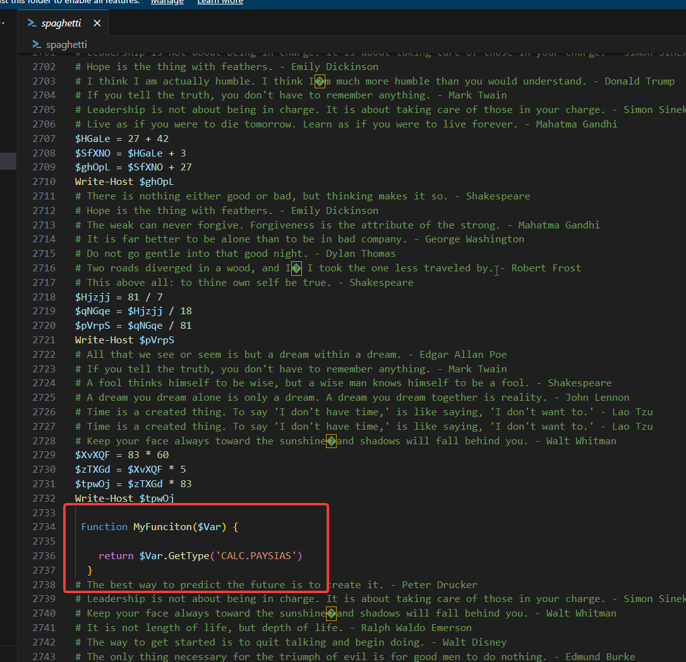
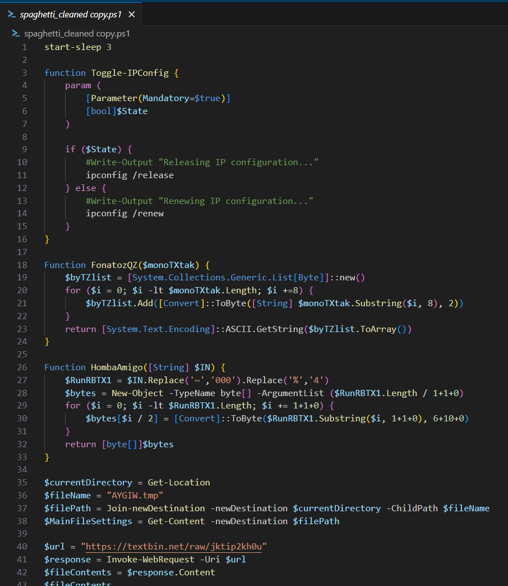
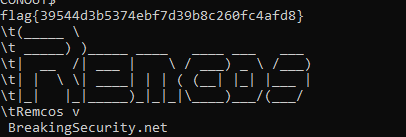
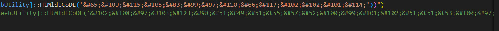
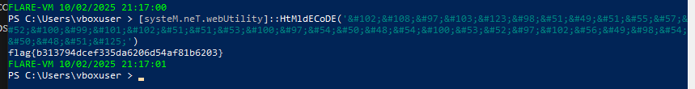
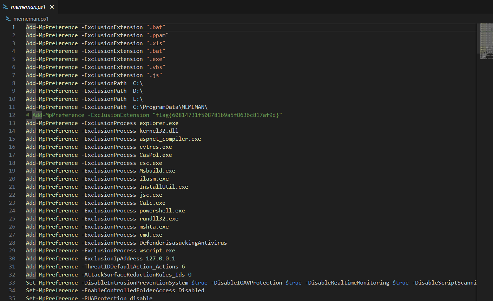

# Spaghetti
**CTF:** Huntress CTF 2025
**Category:** Malware  
**Author:** John Hammond
**Points:** 10  
**Challenge Description:**

```md
You know, I've been thinking... at the end of the day, spaghetti is really just strings of pasta!

Anyway, we saw this weird file running on startup. Can you figure out what this is?

I'm sure you'll get more understanding of the questions below as you explore!
```

## Initial Discoveries

Upon downloading and extracting spaghetti.zip, there is code with many comments and math equations. After scrolling through the code there is various real pieces of code.



After removing all the useless code, we are left with the real stager.



## Functions

FonatozQZ seems like a function that simply takes every 7th letter in a string, meanwhile HombaAmigo replaces ~ with 000 and % with 4. After this, the function converts every 2 letters from hex to a byte.

## MainSettingsFile

Next we have a variable called WULC4, which runs HombaAmigo on the MainFile (AYGIW.tmp). After reusing the conversion code, it was discovered that this is really a PE file.

## Strings Output

Running strings on this exe, we can find that it is a basic REMCOS rat and the flag: `flag{39544d3b5374ebf7d39b8c260fc4afd8}`



## My Fourth Oasis

Looking at the other variables in spaghetti.ps1, we see an variable named MyOasis4 which is very similar to the next task title My Fourth Oasis. Decoding the long string results in a new PowerShell script.

This PowerShell scripts works with the kernel32 dll to override the AmsiScanBuffer memory in amsi.dll. In this file there is a command with a html encoded string.



Running this in my own playground script resulted the flag for My Fourth Oasis



`flag{b313794dcef335da6206d54af81b6203}`

## MEMEMAN

Finally we are left with the TDefo variable in spaghetti.ps1, and when unraveling this encoded string we are left with another PowerShell script. This scripts creates all kind of defender exclusions, disables UAC, stops and disables Windows Defender service, creates the user System32 with password 123 and membership of administrators and Remote Desktop Users, stops WinDefend and WdNisSvc, and finally disables Windows Firewall.

On line 12, there is a commented out line with a fake exclusion command with a flag as a argument.



`flag{60814731f508781b9a5f8636c817af9d}`