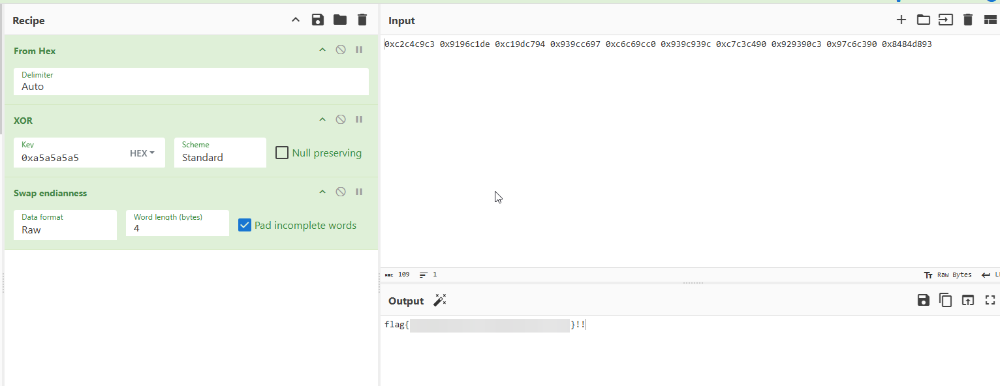

# Verify You Are Human
**CTF:** Huntress CTF 2025
**Category:** Malware  
**Points:** 10  
**Challenge Description:**

```md
My computer said I needed to update MS Teams, so that is what I have been trying to do...

...but I can't seem to get past this CAPTCHA!
```

## TL;DR

Clicking the fake CAPTCHA led the victim to run a PowerShell downloader which fetched a staged Python archive. The real payload was a .pyc file that decompiled to state2.py. The script contained an XOR-encoded shellcode blob; after XOR-decoding the blob, the flag string was revealed.

## Inital Interaction

When opening connecting to the web server, a fake CAPTCHA appears and when clicked instructs the user to press `Windows + R` and paste some powershell.

## Staged Download

The code will then download a file to the LocalAppData directory and name it a random number from 5482-86245 .ps1. When executed, this code will download a fake .pdf, which is really a .zip containing python code, and execute the code contained in `cpython-3134.pyc`.

## Decompilation

After some searching, a website `https://pylingual.io/` can be found which can decompile this .pyc file, which i called state2.py. This is where the real payload resides.

## Extracting Shellcode

With the XOR key directly in the code and CyberChef, I was able to extract out the raw shellcode and save it to `decrypted_shellcode.bin`.

## Static Analysis

Opening the binary in Ghidra, we can see that the code uses XOR encryption again to encode a sequence of characters.


Running this though CyberChef, we can finally get the challenge flag!
