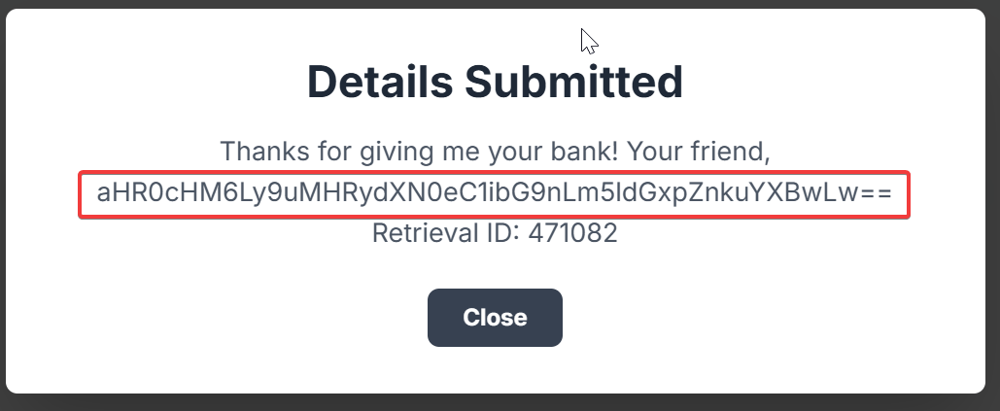
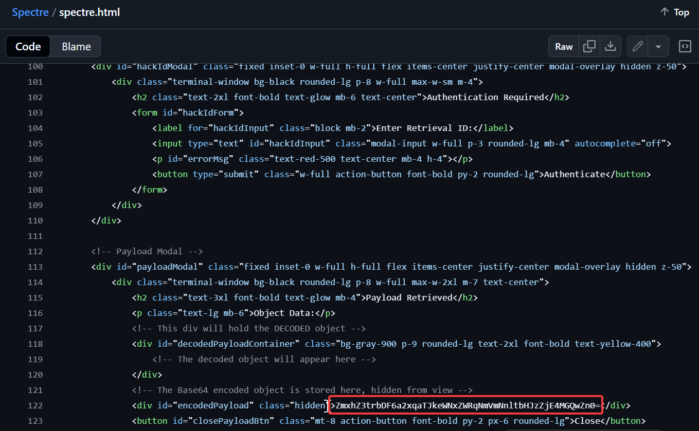

# Follow the Money
**CTF:** Huntress CTF 2025
**Category:** OSINT  
**Points:** 10  
**Challenge Description:**

```md
Hey Support Team,

We had a bit of an issue yesterday that I need you to look into ASAP. There's been a possible case of money fraud involving our client, Harbor Line Bank. They handle a lot of transfers for real estate down payments, but the most recent one doesn't appear to have gone through correctly.

Here's the deal, we need to figure out what happened and where the money might have gone. The titling company is looping in their incident response firm to investigate from their end. I need you to quietly review things on our end and see what you can find. Keep it discreet and be passive.

I let Evelyn over at Harbor Line know that someone from our team might reach out. Her main email is offline right now just in case it was compromised, she's using a temporary address until things get sorted out:

evelyn.carter@51tjxh.onmicrosoft.com
```

```md
The password to the ZIP artifact is follow_the_money.
```

## Initial Research
Looking at the links in the emails provided, we can see that the last email was spoofed with a fake website link which is supposedly a clone our hacker controls.

URLs:

- [Harbor Line Bank](https://harbor-line-bank.netlify.app)
- [Real Evergate Title](https://evergatetitle.netlify.app)
- [Fake Evergate Title](https://evergatetltle.netlify.app)

## Finding Our Hacker
After submitting a bogus closing funds transfer, we receive the following message:



Decoding the base64 in this message gives us with a new link to the hackers blog (<https://n0trustx-blog.netlify.app/>).


We can see that the hacker's username is `n0trustx`, our first answer!

Looking through the blog we can see a link to his connections. In the linked github, there is a project called Spectre. Looking at spectre.html we can see a "encodedPayload":



Decoding this, we are left with the flag: `flag{kl1zklji2dycqedj6ef6ymlrsf180d0f}`