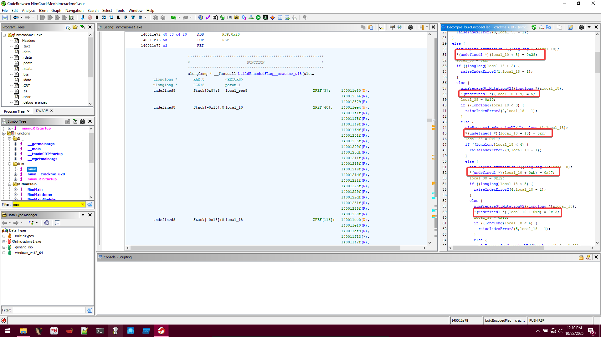
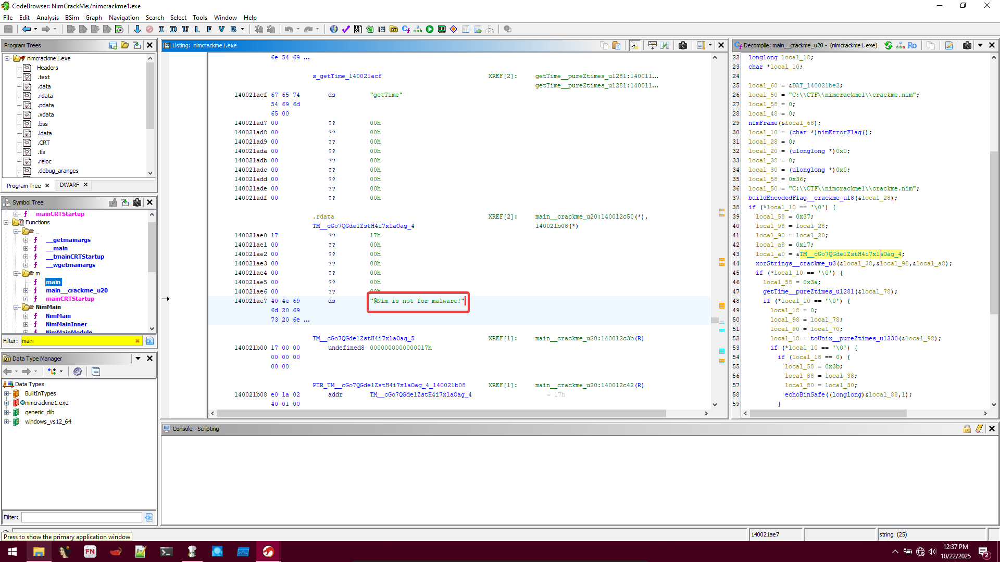
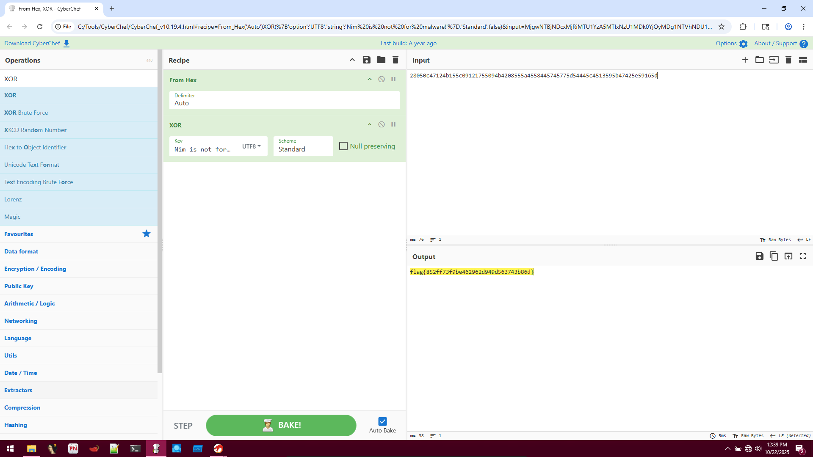

# NimCrackMe1
**CTF:** Huntress CTF 2025
**Category:** Reverse Engineering 
**Author:** John Hammond 
**Points:** 10  
**Challenge Description:**

```md
I just really like Nim, okay, I think it's neat.

(Could very well be used by threat actors too, so it's worth getting a feel for some Nimlang reverse engineering!)
```

## Initial Observations

Knowing that language specific knowledge is important I took a quick dive into [Nimlang](https://nim-lang.org/), but knowing that reverse engineering will look nothing like this, I decided to move on to Ghidra.

After opening the artifact in Ghidra, and navigating to the real main file (main -> NimMain -> NimMainInner -> NimMainModule -> main__crackme__u20). Here we can see the logic the program makes!

## Program Logic

The program completes a simply process:

- Build a encoded flag string
- XOR encoded string
- Echo out flag IF it is a certain time (did not look farther into this)

## Static Route

While you could probably do some dynamic analysis and attach a debugger, maybe even change a check in the assembly, I chose to just look through the code myself.

## Step One (Getting XOR encoded flag)

Opening buildEncodedFlag__crackme_ul18, there are a lot of lines. After some looking though, most of it is just error checking done by Nim and the only important parts are the bytes set into the string that we wil return



The only important parts of this function that we need are the characters of the string being set. I opted to keep them in hex form knowing that we will XOR them after and the characters would not look good in ascii form.

After gathering all the hex bits, our hex string should look something like `28050c47124b155c09121755094b4208555a4558445745775d54445c4513595b47425e59165d`.

## Step Two (XOR Decrypt flag)

Looking at the function `xorStrings__crackme_u3`, we can see that the first param is the return value, second is the encoded string, and the 3rd the XOR key.

This function is a simple `do while i <= length`, which the most important line being:
`*(byte *)(local_a0 + 8 + local_80) ^ *(byte *)(local_28 + local_90 + 8)`.

We can find that:
- local_a0 is the 1st index of our XOR key
- local_80 is `local_28 % local_a8`
    - local_a8 is a pointer to the XOR key
- local_28 is set to local_20 each time the loop runs (essentially also current index)
    - local_20 is our current index
- local_90 is the 1st index of our encoded string.

Lets go back for a second and find what our key even is. We can see that $TM__cGo7QGde1ZstH4i7xlaOag_4 is set as the key. By clicking this variable in Ghidra, we can see the value. 



From this image, we can find that the XOR key is the string "@Nim is not for malware!"

Thus, decoded we can turn this line into:
`*(byte *)(1stXORkey + 8 + remainerIndex) ^ *(byte *)(index + encodedString + 8)` or more simply `"Nim is not for malware!" ^ encodedString`.



Going to Cyberchef we can plug-in these values and we are returned with the flag!

flag: `flag{852ff73f9be462962d949d563743b86d}`