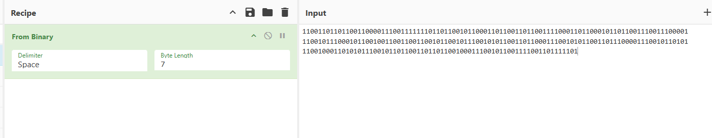

# Just a Little Bit
**CTF:** Huntress CTF 2025
**Category:** Warmups  
**Author:** John Hammond
**Points:** 10  
**Challenge Description:**

```md
If just a little bit were to go missing... would it really even matter?
```

```md
11001101101100110000111001111111011011001011000110110011011001111000110110001011011001110011100001
11001011100010110010011001100110010110010111001010110011011000111001010110011011100001110010110101
1100100011010101110010110110011011011001000111001011001111001101111101
```

At the first sight of this string of 1s and 0s, I thought of binary to ascii. And to my suprise, I was really close. 

Trying with a missing bit, I realized it really was that simple after plugging the cypher into CyberChef.



resulting in the flag of `flag{2c33c169aebdf2ee31e3895d5966d93f}`