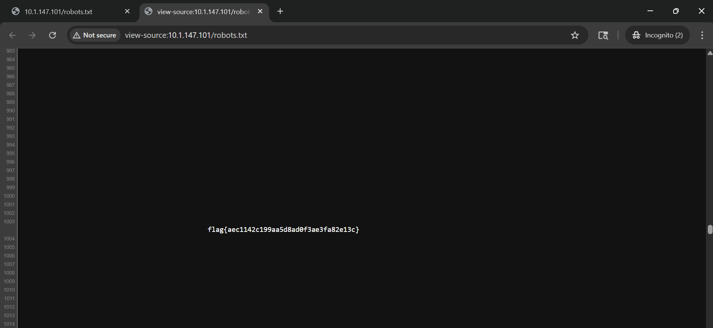

# RFC 9309
**CTF:** Huntress CTF 2025
**Category:** Warmups  
**Author:** John Hammond
**Points:** 10  
**Challenge Description:**

```md
Sorry. You know every CTF has to have it. 🤷
```

Looking up RFC 9309, I realized this relates to robots.txt and the user agents.

Scrolling down in robots.txt, you can find the flag in the robots.txt



Flag: `flag{aec1142c199aa5d8ad0f3ae3fa82e13c}`#