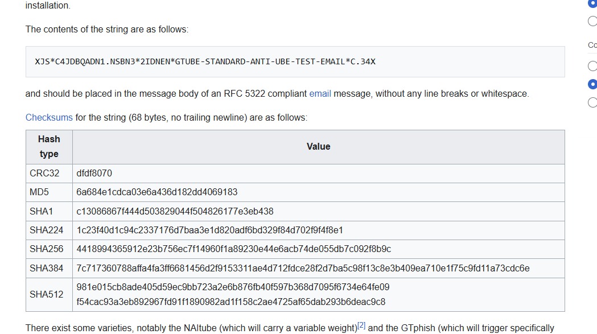

# Spam Test
**CTF:** Huntress CTF 2025
**Category:** Warmups  
**Author:** John Hammond
**Points:** 10  
**Challenge Description:**

```md
Time to do some careful Googling... what's the MD5 hash of the Generic Test for Unsolicited Bulk Email (GTUBE) string?

Submit the hash wrapped within the flag{ prefix and } suffix to match the standard flag format.
```

For this challenge I first searched for waht GTUBE was. I found a nice explaination on [Wikipedia](https://en.wikipedia.org/wiki/GTUBE). Where there just so happened to be a chart of the various hashes of the test.



This leaves me with the MD5 hash of: `flag{6a684e1cdca03e6a436d182dd4069183}`