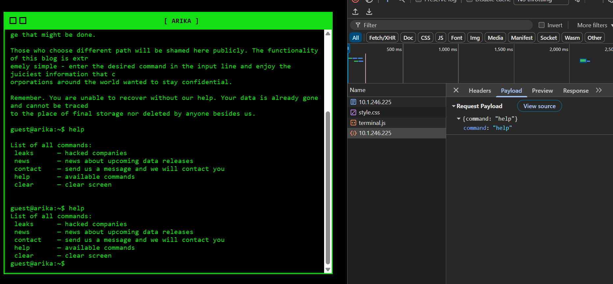
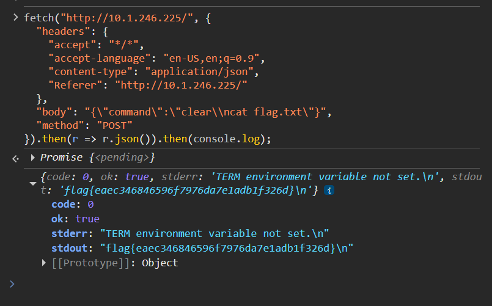

# ARIKA
**CTF:** Huntress CTF 2025
**Category:** Warmups  
**Author:** John Hammond
**Points:** 10  
**Challenge Description:**

```md
The Arika ransomware group likes to look slick and spiffy with their cool green-on-black terminal style website... but it sounds like they are worried about some security concerns of their own!
```

> The password for the ZIP archive  is arika.

Going to the website, we see that it runs certain allowed commands and that is all. It does this through a POST request to the root.



This challenges provides us with the full backend of the application. After looking through app.py, we can see that the error comes down to this line of code.

```py
if not any([ re.match(r"^%s$" % allowed, command, len(ALLOWLIST)) for allowed in ALLOWLIST]):
        return jsonify(ok=False, stdout="", stderr="error: Run 'help' to see valid commands.\n", code=2)
```

There is a simply issue with this command, we only need this check to pass once, and the 3rd parameter of re.match is `flags`. By setting this value to 8, the length of ALLOWLIST, we is effectively setting flags to `re.MULTILINE`. This mean that ^ acts as the beginning of the string or beginning of a new line and $ is the end of the string or end each line.

Looking at how code is executed (simply passed into /bin/sh), we can implement new lines to run commands. Using all this knowledge together we can modify the post requests the website makes to get the flag.txt

Using google chrome's developer tools, I copied the existing POST request and added another command on a new line, this resulted in the flag!



`flag{eaec346846596f7976da7e1adb1f326d}`