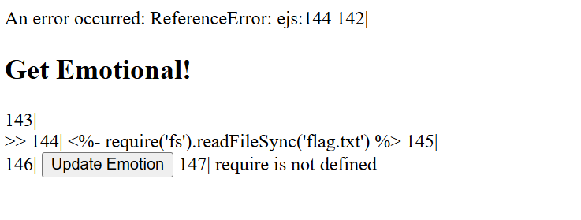

# Emotional
**CTF:** Huntress CTF 2025
**Category:** Warmups  
**Author:** John Hammond
**Points:** 10  
**Challenge Description:**

```md
Don't be shy, show your emotions! Get emotional if you have to! Uncover the flag.
```

## Initial Observations

The website in this challenge makes a POST request to `/setEmoji` with the emoji as a payload. With this information, I experimented with what happens if I send that request but with something else instead. After, reloading the page I see that the request indeed did save the invalid emoji. Using this, I can now try forms of XSS to hopefully achieve server-side code execution.

The server must have been storing this somehow and referencing it later, but this would be on the client, we need something server. So, I tried common template syntax in an attempt to escape that. John Hammond also released the source code (located in the artifacts folder), meaning the answer was EJS.

## Require issue

Knowing this, I experimented with requiring fs so that I could simply read out the file. I would keep getting a require is undefined error. 



## Require Bypass

In aspiration to continue this method, I researched other methods to read file contents without require and I stumbled upon using process.mainModule to spawn a child process to cat out the flag. With that the payload now looked like this: `<%= global.process.mainModule.require('child_process').execSync('cat ./flag.txt').toString() %>`, and that worked! I was able to recieve the flag `flag{8c8e0e59d1292298b64c625b401e8cfa}`!

## Going Back
I realized that this code still uses require and so I might be able to get fs still. Prompting me to create another payload: `<%= global.process.mainModule.require('fs').readFileSync('./flag.txt', 'utf-8') %>`. This achieved my original goal of using fs!

## Learning Experiences

When making a website in EJS, ensure that any request that can be made by the client is sanitized and will not execute code on the server, unless that is the purpose. In that case, ensure that the user can not override your template expressions and escape the output to not allow arbitrary code execution.

Require is not a global method (I thought it was), but if you have the process object, you can retrieve mainModule (require.main) and call the require method. What a work around method!